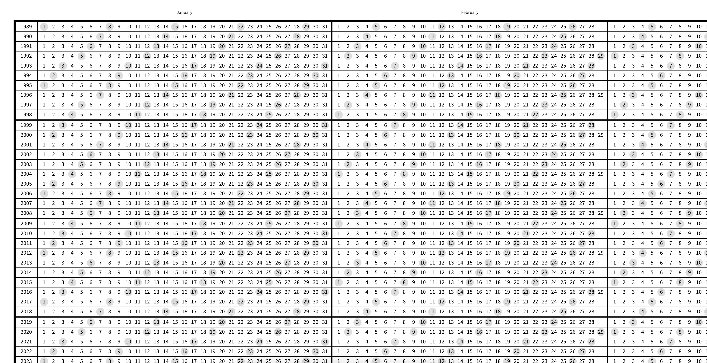

# Hundred Year Calendar Generator v. 1.0

## What Is This?
This repo contains a program that can be used to generate a visually pleasing 100 year calendar. Sundays are highlighted with a gentle grey dot to give a sense of each week's duration.

**Example**

This work is motivated by the idea that cultivating a long-term perspective on one's live is not only a healthy individual outlook, but also, possibly, one that leads to beneficial societal outcomes (see e.g. [The Long Now Foundation](http://longnow.org/)).

This work is inspired by On Kawara's 100 Year Calendars, which the primary author of this code first encountered at the Dia:Beacon in New York (see the [Dia:Beacon's website page about On Kawara](https://www.diaart.org/program/exhibitions-projects/on-kawara-collection-display) and the [Wikipedia page about the Dia:Beacon](https://en.wikipedia.org/wiki/Dia:Beacon)).

This work is designed to make it relatively easy to export the generated calendar to a file that can be printed on professional printing equipment. At this stage, however, one does need to use a vector drawing program (e.g. [Inkscape](https://inkscape.org/)) in order to do so.

The code is written in JavaScript and is highly configurable. It uses SVG.js (to provide for easy SVG manipulation), moment.js (for ease of computing calendar data), and Google Fonts' Source Sans Pro. It can be run in a modern web browser (it's been tested in Chromium 71).

## Examples
A lightweight snapshot can be found at [sample_exports/sample_export_partial.png](sample_exports/sample_export_partial.png "A sample portion of the calendar")

Full sample exports (for a 100 year calendar starting in 1989) are provided in the [sample_exports/ folder](sample_exports/).

## Prior Art
Leon Eckert created [a Python script](https://github.com/leoneckert/100-year-calendar) which generates an ASCII version of On Kawara's original calendar.

Similarly, [Tim Urban](https://waitbutwhy.com/) offers a ["Life in Weeks" calendar](https://waitbutwhy.com/2014/05/life-weeks.html) on his website. Some folks similarly created generators for those (see comments on the blog post linked to).

## How To Use This
At the moment, usage of this script is a little hacky. In the future, I hope to make this easier to use by providing a convenient front-end interface.

At the moment, one needs to open the [code/index.html](code/index.html) file in their browser. The calendar is then generated and should appear after a short wait (~12 seconds on a 2017 laptop for a full 100 year calendar). The calendar's data (e.g. start date) and styling can be largely configured by editing the values of the `config` constant in [code/main.js](code/main.js).

## Future versions/desired features
My wishlist for future versions:
* **Port this client-side code to server-side**: it would be nice to have this code run on a e.g. Node.js server which would do the computation and serve the finished product (in SVG or some other format) directly to the user.
* **Direct "Save As"**: at the moment, the SVG file is displayed inline in the HTML document's DOM. We would like to enable users to directly save the SVG file.
* **Reduce SVG filesize**: a full 100 year calendar is about 15 MB, which could be reduced by drawing less individual objects.
* **Automatically rasterize fonts**: at the moment, fonts at called for explicitly in the SVG, and rasterization is done by importing the file in a vector drawing software and manually rasterizing them.
* **Export in printer-friendly formats**: SVG was primarily designed for the web, and while it's convenient to use when generating a calendar using JavaScript, printers generally prefer PDF or PS files. A direct export to that format would be desirable.
* **Recalculate dates only, not the calendar's layout**: this could be a nice optimization for vanity's sake, but is not a high priority given the relative efficiency of the current code.
* **Provide basic loading/progress bar**: to ease the user's nerves while their computer's fans blow up.
* **Create vertical version**: where years are on the top and months flow vertically.
* **Provide multiple themes**: multiple pre-set themes would be a good way to accommodate different tastes. After all, if you have to look at something for the next 100 years, it might as well look good to you!
* **Refactor calendar generation code**: could be made a bit easier to read.
* **Provide for configurable "highlighted" day of the week**: at the moment, the calendar highlights Sundays, but I would prefer to let the user chose which day(s) to highlight.
* **Proper package management**: using .js copies of libraries is not ideal

## License
All the original code of this project is released under the MIT License.
